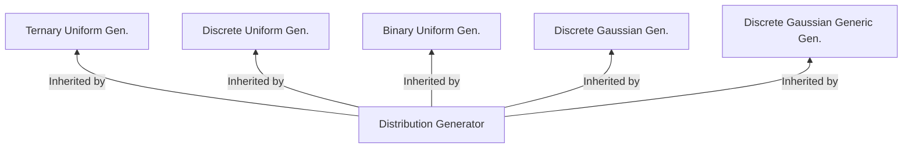

# OpenFHE Core Math

Мы приводим краткое описание ниже, но рекомендуем читателям обратиться к
к [Read The Docs - Core Math](https://openfhe-development.readthedocs.io/en/latest/assets/sphinx_rsts/modules/core/math/core_math.html) для получения более подробной информации о коде.

Кроме того, мы рекомендуем читателям обратиться к [Read The Docs - Core Math Backends](https://openfhe-development.readthedocs.io/en/latest/assets/sphinx_rsts/modules/core/math/core_math_backends.html).

# Математические бэкенды

OpenFHE поддерживает ряд математических бэкендов для различных случаев использования. За дополнительной информацией обращайтесь к разделу [Math Backends](math_backends.md).

# Диаграмма наследования

Пусть Gen. = Generator

# Листинги файлов

[Binary Uniform Generator](binaryuniformgenerator.h)

- Генерирует `равномерное` распределение двоичных значений (mod 2)

[DFT Transform](dftransform.h)

- Дискретное преобразование Фурье (ДПФ)

[Discrete Gaussian Generator](discretegaussiangenerator.h)

- Генерирует `гауссово` распределение дискретных значений.

[Discrete Gaussian Generator Generic](discretegaussiangeneratorgeneric.h)

- Реализует общий сэмплер от UCSD, рассмотренный в [Gaussian Sampling over the Integers:
  Efficient, Generic, Constant-Time](https://eprint.iacr.org/2017/259.pdf)

[Discrete Uniform Generator](discreteuniformgenerator.h)

- Генерирует `равномерное` распределение дискретных значений.

[Distr Gen](distrgen.h)

- Базовая функциональность генерации шума

[Distribution Generator](distributiongenerator.h)

- Базовый класс для генераторов распределений

[Hardware Abstraction Layer (HAL)](hal.h)

- Код для переключения между математическими бэкендами

[Matrix](matrix.h)

- Шаблонная реализация матрицы для SIMD-совместимого матричного кода

[Matrix Strassen](matrixstrassen.h)

- Операции матрицы Штрассена

[NB Theory](nbtheory.h)

- Утилиты теории чисел
- Проверка, являются ли два числа простыми
- GCD двух чисел
- Проверка на первичность
- Функция-свидетель для проверки, является ли число простым
- Функция Эйлерса Totient phin(n)
- Алгоритм генератора

[Ternary Uniform Generator](ternaryuniformgenerator.h)

- Обеспечивает генерацию равномерного распределения двоичных значений
